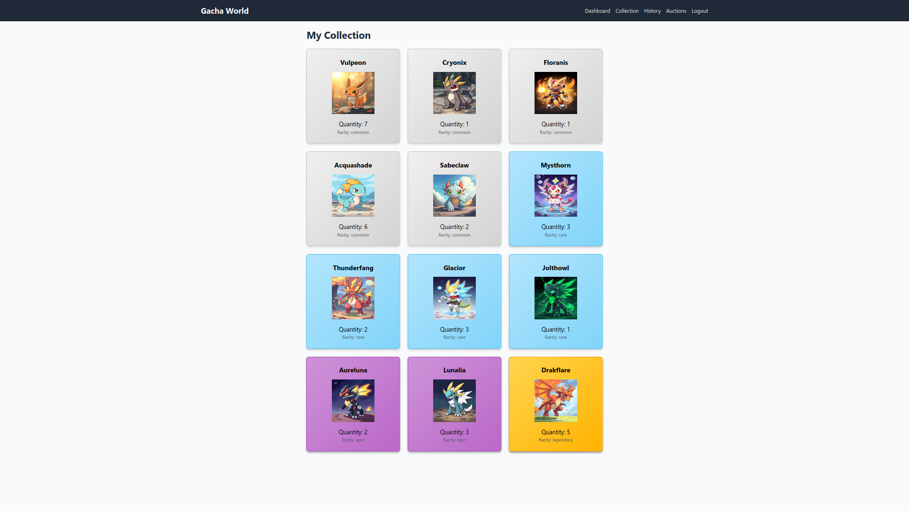

# gacha-world

Catching gachas for fun  
See the [API documentation](docs/README.md) for more information.



## Usage

### Set up Environment

Rename `.env.example` to `.env` in the root folder and in the frontend folder and change the values as needed.

```bash
cp .env.example .env
cp frontend/.env.example frontend/.env
```

### Create HTTPS certificates & JWT Secrets

Create self-signed certificates + private and public key for JWT:

```bash
./init.sh
```

### Build the application

```bash
docker compose up -d --build
```

### Access the endpoints

By default, APIs are served on https://localhost.  
See the [API documentation](docs/README.md) for more information.

### Mock frontend

Install npm dependencies:

```bash
cd frontend
npm install
cd -
```

Run the frontend:

```bash
cd frontend
npm start
```

Open the browser and navigate to https://localhost:3000

> **Warning:** Certificates are self-signed and not trusted by the browser. You need to manually navigate to https://localhost and trust the certificates as prompted, otherwise the authentication will not work.

## Testing

### Unit Tests

Prepare the environment:

```bash
npm install -g newman
```

Auth service:

```bash
cd tests
./auth_unit_test.sh
cd -
```

Player service:

```bash
cd tests
./player_unit_test.sh
cd -
```

Auction service:

```bash
cd tests
./auction_unit_test.sh
cd -
```

### Integration Testing (ATTENTION: This will remove all data in the volumes)

Auth service:

```bash
cd tests
./auth_integration_test.sh
cd -
```

Player service:

```bash
cd tests
./player_integration_test.sh
cd -
```

Auction service:

```bash
cd tests
./auction_integration_test.sh
cd -
```

### Security Testing

Run the security tests:

```bash
# Test 1: Check for vulnerabilities in python code
pip install bandit && bandit -r ./services

# Test 2: Check for vulnerabilities in python dependencies
sh -c "pip install pip-audit && find ./services -name 'requirements.txt' -exec pip-audit -r {} \\;"
```
