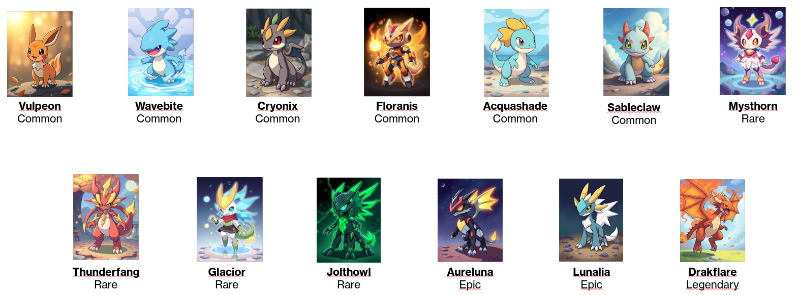
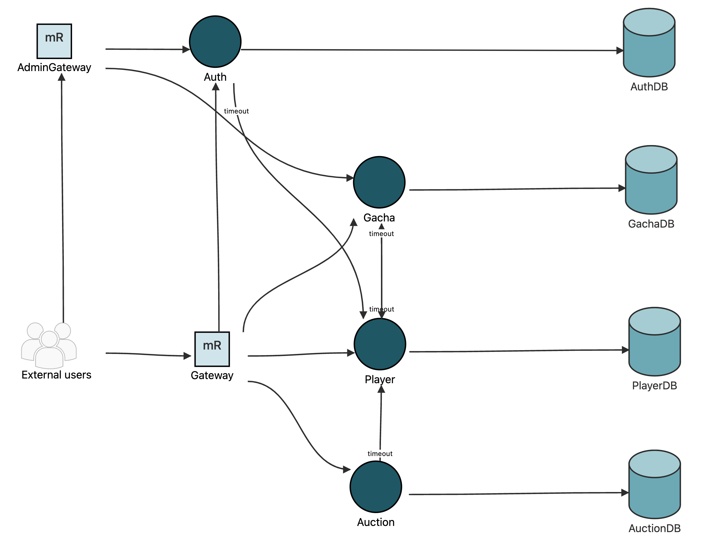
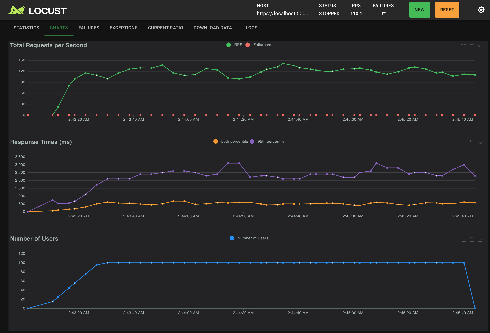
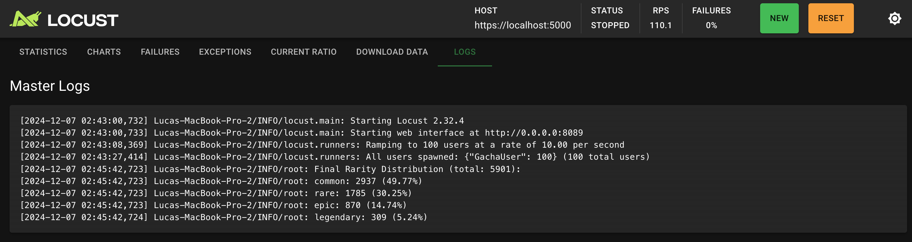
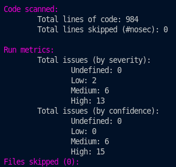
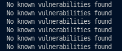
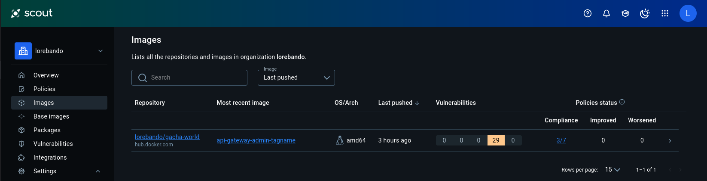

# Capture the Gacha

**Advanced Software Engineering (Lab) – 2024/2025**

*Lorenzo Bandini, Samuele Franchi, Luca Cordisco*

---

## Table of Contents

- [Capture the Gacha](#capture-the-gacha)
  - [Table of Contents](#table-of-contents)
  - [1. Introduction](#1-introduction)
  - [2. Gacha Overview](#2-gacha-overview)
    - [2.1 Description](#21-description)
    - [2.2 Rarities and Probabilities](#22-rarities-and-probabilities)
    - [2.3 Our Gachas](#23-our-gachas)
  - [3. Architecture](#3-architecture)
    - [3.1 Overview](#31-overview)
    - [3.2 Microservices](#32-microservices)
    - [3.3 Interactions and Design Decisions](#33-interactions-and-design-decisions)
  - [4. User Stories](#4-user-stories)
    - [Account Management](#account-management)
    - [Collection Management](#collection-management)
    - [Market Operations](#market-operations)
  - [4.2 User Stories for Admin](#42-user-stories-for-admin)
    - [Admin Account Management](#admin-account-management)
    - [Gacha Management](#gacha-management)
  - [5. Market Rules](#5-market-rules)
  - [6. Testing](#6-testing)
    - [Unit Testing](#unit-testing)
    - [Integration Testing](#integration-testing)
    - [Performance Testing](#performance-testing)
  - [7. Security – Data](#7-security--data)
    - [7.1 Input Validation with Pydantic](#71-input-validation-with-pydantic)
    - [7.2 Data Encryption](#72-data-encryption)
  - [8. Security – Authorization and Authentication](#8-security--authorization-and-authentication)
  - [9. Security – Analyses](#9-security--analyses)
    - [Static Analysis](#static-analysis)
    - [Pip-Audit](#pip-audit)
    - [Docker Image Vulnerabilities](#docker-image-vulnerabilities)
    - [GitHub Dependabot](#github-dependabot)

---

## 1. Introduction

This document presents the final report for the **Capture the Gacha** project. Our goal was to design and implement a microservices-based application featuring Gacha mechanics and an auction-based marketplace in a secure and scalable architecture.

The system provides the following core functionalities:

- Player and admin management with secure login/logout.
- Gacha mechanics, including random drop based on predefined rarities.
- Auctions for trading Gachas between players.

---

## 2. Gacha Overview

### 2.1 Description

In our system, a **Gacha** represents a collectible item that players can obtain through rolls, which are random draws. Each Gacha has an associated name, rarity, and image, and is uniquely identified by an ID to distinguish it from other Gachas.

### 2.2 Rarities and Probabilities

The Gachas are categorized into four rarities, each with a specific probability of being obtained through rolls:

| Rarity    | Probability |
|-----------|-------------|
| Common    | 50%         |
| Rare      | 30%         |
| Epic      | 15%         |
| Legendary | 5%          |

### 2.3 Our Gachas



---

## 3. Architecture



### 3.1 Overview

Our system is designed using a microservices architecture, orchestrated with Docker Compose. Each service operates independently and communicates over secure RESTful APIs.

### 3.2 Microservices

| Microservice       | Description                                                         | Language/Technology |
|--------------------|---------------------------------------------------------------------|---------------------|
| **Auth Service**   | Manages user authentication, registration, login/logout, token issuance | Python (FastAPI)    |
| **Player Service** | Manages player profiles, balances, and collections                   | Python (FastAPI)    |
| **Gacha Service**  | Handles Gacha rolls and manages Gacha items                          | Python (FastAPI)    |
| **Auction Service**| Manages auctions, bidding processes, and auction settlements         | Python (FastAPI)    |
| **Gateway**        | Acts as an API gateway, routing requests to appropriate services     | Python (FastAPI)    |
| **Admin Gateway**  | Provides administrative access to manage Gachas and players          | Python (FastAPI)    |

### 3.3 Interactions and Design Decisions

- **Auth Service** issues JWT tokens upon successful login. Tokens are validated by other services for authentication and authorization.
- **Auth Service** interacts with the **Player Service** to create new player accounts
- **Player Service** interacts with the **Gacha Service** to roll a gacha
- **Auction Service** communicates with the **Player Service** to transfer Gachas and update player balances during auctions.
- **Gacha Service** interacts with the **Player Service** to ensure consistency when a gacha is deleted.
- **Gateway** routes requests from clients to the appropriate microservices
- **Admin Gateway** interacts with both **Auth Service** and **Gacha Service** to manage administrative tasks securely.

---

## 4. User Stories

### Account Management

• **AS A** player, **I WANT TO** create my game account/profile **SO THAT** I can participate in the game
    - **Endpoint:** `POST /register`
    - **Microservices:** Gateway, Auth Service, Auth DB, Player Service, Player DB

• **AS A** player, **I WANT TO** delete my game account/profile **SO THAT** I can stop participating in the game
    - **Endpoint:** `DELETE /deleteAccount`
    - **Microservices:** Gateway, Auth Service, Auth DB

• **AS A** player, **I WANT TO** modify my account/profile **SO THAT** I can personalize my account/profile
    - **Endpoint:** `PATCH /editAccount`
    - **Microservices:** Gateway, Auth Service, Auth DB

• **AS A** player, **I WANT TO** login and logout from the system **SO THAT** I can access and leave the game
    - **Endpoints:** `POST /login`, `POST /logout`
    - **Microservices:** Gateway, Auth Service, Auth DB

• **AS A** player, **I WANT TO** be safe about my account/profile data **SO THAT** nobody can enter my account and steal/modify my info
    - **Endpoints:** *(Handled by authentication and authorization mechanisms)*
    - **Microservices:** Gateway, Auth Service, Auth DB

### Collection Management

• **AS A** player, **I WANT TO** see my gacha collection **SO THAT** I know how many gachas I need to complete the collection
    - **Endpoint:** `GET /getCollection`
    - **Microservices:** Gateway, Player Service, Player DB

• **AS A** player, **I WANT TO** see the info of a gacha in my collection **SO THAT** I can view all the details of one of my gachas
    - **Endpoint:** `GET /gachas/{gacha_id}`
    - **Microservices:** Gateway, Gacha Service, Gacha DB

• **AS A** player, **I WANT TO** see the system gacha collection **SO THAT** I know what I miss in my collection
    - **Endpoint:** `GET /gachas`
    - **Microservices:** Gateway, Gacha Service, Gacha DB

• **AS A** player, **I WANT TO** see the info of a system gacha **SO THAT** I can view the details of a gacha I am missing
    - **Endpoint:** `GET /gachas/{gacha_id}`
    - **Microservices:** Gateway, Gacha Service, Gacha DB

• **AS A** player, **I WANT TO** use in-game currency to roll a gacha **SO THAT** I can increase my collection
    - **Endpoint:** `GET /roll`
    - **Microservices:** Gateway, Gacha Service, Player Service, Gacha DB, Player DB

• **AS A** player, **I WANT TO** be safe about the in-game currency transactions **SO THAT** my in-game currency is not wasted or stolen
    - **Handled by secure transaction mechanisms**
    - **Microservices:** Gateway, Player Service, Auth Service

### Market Operations

• **AS A** player, **I WANT TO** see the auction market **SO THAT** I can evaluate if I want to buy/sell a gacha
    - **Endpoint:** `GET /getAuctions`
    - **Microservices:** Gateway, Auction Service, Auction DB

• **AS A** player, **I WANT TO** set an auction for one of my gachas **SO THAT** I can increase in-game currency
    - **Endpoint:** `POST /sell`
    - **Microservices:** Gateway, Auction Service, Auction DB, Player Service, Player DB

• **AS A** player, **I WANT TO** bid for a gacha from the market **SO THAT** I can increase my collection
    - **Endpoint:** `POST /bid/{auction_id}/{bid}`
    - **Microservices:** Gateway, Auction Service, Auction DB, Player Service, Player DB

• **AS A** player, **I WANT TO** view my transaction history **SO THAT** I can track my market movements
    - **Endpoint:** `GET /getAuctions`
    - **Microservices:** Gateway, Auction Service, Auction DB

• **AS A** player, **I WANT TO** receive a gacha when I win an auction **SO THAT** only I have the gacha I bid for
    - **Endpoints:** *(Handled internally by Auction Service and Player Service)*
    - **Microservices:** Gateway, Auction Service, Player Service, Auction DB, Player DB

• **AS A** player, **I WANT TO** receive in-game currency when someone wins my auction **SO THAT** the gacha sale works as expected
    - **Endpoints:** *(Handled internally by Auction Service and Player Service)*
    - **Microservices:** Gateway, Auction Service, Player Service, Auction DB, Player DB

• **AS A** player, **I WANT TO** receive my in-game currency back when I lose an auction **SO THAT** my in-game currency is only decreased when I buy something
    - **Endpoints:** *(Handled internally by Auction Service and Player Service)*
    - **Microservices:** Gateway, Auction Service, Player Service, Auction DB, Player DB

• **AS A** player, **I WANT TO** ensure that the auctions cannot be tampered with **SO THAT** my in-game currency and collection are safe
    - **Endpoints:** *(Ensured by secure communication and authentication mechanisms across all services)*
    - **Microservices:** All relevant microservices, particularly Auth Service and Auction Service

## 4.2 User Stories for Admin

### Admin Account Management

• **AS AN** admin, **I WANT TO** login and logout as an admin **SO THAT** I can manage the system
    - **Endpoints:** `POST /login`, `POST /logout`
    - **Microservices:** Admin Gateway, Auth Service, Auth DB

• **AS AN** admin, **I WANT TO** logout when I am done **SO THAT** my admin session is secure
    - **Endpoint:** `POST /logout`
    - **Microservices:** Admin Gateway, Auth Service, Auth DB

• **AS AN** admin, **I WANT TO** delete my account **SO THAT** I can remove my administrative access
    - **Endpoint:** `DELETE /deleteAccount`
    - **Microservices:** Admin Gateway, Auth Service, Auth DB

### Gacha Management

• **AS AN** admin, **I WANT TO** see all gachas **SO THAT** I can monitor the available gacha items
    - **Endpoint:** `GET /gachas`
    - **Microservices:** Admin Gateway, Gacha Service, Gacha DB

• **AS AN** admin, **I WANT TO** see a specific gacha by ID **SO THAT** I can view its details
    - **Endpoint:** `GET /gachas/{gacha_id}`
    - **Microservices:** Admin Gateway, Gacha Service, Gacha DB

• **AS AN** admin, **I WANT TO** publish a new gacha **SO THAT** I can add new items to the system
    - **Endpoint:** `POST /gachas`
    - **Microservices:** Admin Gateway, Gacha Service, Gacha DB

• **AS AN** admin, **I WANT TO** modify a gacha with a specific ID **SO THAT** I can update its details
    - **Endpoint:** `PUT /gachas/{gacha_id}`
    - **Microservices:** Admin Gateway, Gacha Service, Gacha DB

• **AS AN** admin, **I WANT TO** delete a gacha **SO THAT** I can remove items from the system
    - **Endpoint:** `DELETE /gachas/{gacha_id}`
    - **Microservices:** Admin Gateway, Gacha Service, Gacha DB, Player Service, Player DB

---

## 5. Market Rules

Our marketplace operates under the following rules to ensure fair and secure transactions:

- **Bid Handling**:
  - When a player places a bid higher than the current highest bid, the previous highest bidder is automatically refunded their bid amount.

- **Last-Second Bidding**:
  - If a bid is placed within the last 30 seconds of the auction's expiration, the auction expiration time is extended by an additional 30 seconds to allow for counter-bids.

- **Highest Bidder Restrictions**:
  - Players cannot place a bid on an auction if they are already the highest bidder. This prevents players from repeatedly outbidding themselves to unfairly extend the auction duration.

- **Auction Expiration**:
  - If no bids are placed, the auction expires, and the Gacha is returned to the seller.
  - Upon auction completion, if there is a highest bidder, the Gacha is transferred to them, and the seller receives the final bid amount.

- **Currency Management**:
  - Players' in-game currency is securely managed. When a player places a bid, the bid amount is deducted from their balance. If outbid, the amount is refunded promptly.
  - If a player wins an auction, the bid amount is transferred to the seller, ensuring transparent and secure transactions.

- **Auction Closure**:
  - The system automatically handles auction expirations, closing auctions and processing settlements without manual intervention.

- **Transaction Security**:
  - All transactions are processed securely to prevent unauthorized access and ensure data integrity.

---

## 6. Testing

We conducted comprehensive testing to ensure the reliability, performance, and security of our services:

**GitHub Actions Workflow:** both Unit Tests and Integration Tests are executed in dedicated jobs in the CI/CD pipeline. They can be viewed in the docs/workflows folder.

### Unit Testing

- **Description**: Unit tests were developed for all microservice endpoints involving player operations. Each endpoint has at least one test for correct input (expecting a `200 OK` response) and one for incorrect input (expecting an error response).

- **Tools Used**: Postman

- **Implementation**:
  - Created Postman collections to cover all player-related endpoints.
  - Each endpoint within these collections includes tests for both valid and invalid inputs to ensure proper handling and response codes.
  - To test the services in isolation, each of them has an individual docker-compose.yml file, which also creates the associated database.

### Integration Testing

- **Description**: Integration tests were performed against the API Gateway using the same Postman collections used for unit testing to verify the interactions between microservices within the live architecture.

- **Tools Used**: Postman

- **Implementation**:
  - Newman executes integration tests defined in a shared Postman collection.
  - The integration-test job in our workflow runs all microservices together using the Docker Compose file in the project root.

The README.md file in the project root contains instructions on how to run both Unit and Integration tests.

### Performance Testing

- **Description**: Performance tests were executed to evaluate the system's behavior under high load and verify the accuracy of gacha rarity distributions under stress.

- **Tools Used**: Locust

- **Implementation**:
We ran performance tests with Locust against the player endpoints that handle gacha operations. By hitting these endpoints with a large number of requests, we confirmed that the rarity distribution of gacha rolls stayed within the expected ranges and that the endpoints performed well.
Access to player features requires authentication, so we had to secure every request with a valid JSON Web Token (JWT). To get the token, we used the /login endpoint and provided a username and password.



Our tests focused on the /roll endpoint, verifying that the rarities matched the distribution described in Section 2.2.
Overall, the system proved both efficient and scalable, easily handling a large number of concurrent requests. After an initial spike, the system maintained a steady rate of requests per second, represented by the green line. No failures occurred during the test, which would have shown up as a red line if they had happened. When stopping the test, the distribution of the the rarities get displayed in the logs.


---

## 7. Security – Data

### 7.1 Input Validation with Pydantic

- **Microservices**: Auth Service
- **Description**: User inputs are validated using Pydantic models, which enforce data types and constraints, eliminating the need for manual input sanitization.
- **Implementation**: Pydantic models automatically validate input data during request processing, ensuring that all inputs adhere to required formats and preventing invalid or malicious data entries.

### 7.2 Data Encryption

- **Encrypted Data at Rest**:
  - **Data**: User passwords
  - **Database**: Auth Service Database
  - **Encryption Method**: Passwords are hashed and salted using bcrypt before storage.
  - **Encryption Location**: Passwords are hashed in the Auth Service before being stored, ensuring plaintext passwords are never saved or transmitted.

---

## 8. Security – Authorization and Authentication

The system uses a distributed approach for authorization and authentication. Instead of having a single microservice dedicated to these tasks, all microservices are able to decode JWT tokens. When a user logs in, they get a JWT token that must be included in the Authorization header for any future requests to the Gachana application. Each endpoint validate the token by checking its signature using the public key to determine the user’s identity and role (player or admin). Tokens aren’t stored in the database; they are simply sent along with each request.

- **Access Token Payload Format**:

  ```json
  {
    "iss": "https://auth.server.com",
    "sub": "<user_id>",
    "iat": <issued_at_timestamp>,
    "exp": <expiration_timestamp>,
    "jti": "<unique_token_id>",
    "role": "<user_role>"
  }
  ```

- **Role-Based Access**:
  - Roles (`user`, `admin`) are embedded in the token payload, allowing services to enforce access control based on user roles.

---

## 9. Security – Analyses

### Static Analysis

- **Tool Used**: Bandit
- **Command Used**: `docker-compose run bandit`
- **Implementation**: Created a service in the `docker-compose` file under the `security` profile, which uses a Python 3.9 image and runs `bandit` recursively on all services. As you can see, it shows 13 high-severity issues and 6 medium-severity issues. However, they only relate to the use of self-signed certificates and the binding of the services to all interfaces, which is not a problem since they're running under the docker compose network.



### Pip-Audit

- **Tool Used**: pip-audit
- **Command Used**: `docker-compose run pip-audit`
- **Implementation**: Created a service in the `docker-compose` file under the `security` profile, which uses a Python 3.9 image and runs `pip-audit` recursively on all services. It identifies outdated or vulnerable Python packages and reports potential security issues, along with guidance on how to address them.
- **Results**: The scan of each service did not uncover any vulnerabilities.



### Docker Image Vulnerabilities

- **Tool Used**: Docker Scout
- **Results**: Docker Scout was used to scan the Docker images associated with the project. It detects vulnerabilities in base images, identifies outdated dependencies, and provides actionable steps to resolve these issues by suggesting safer versions or alternative images. No image analyzed by Docker Scout has now either high or critical vulnerabilities.



### GitHub Dependabot

- **Tool Used**: GitHub Dependabot
- **Results**: Dependabot was enabled in the GitHub repository to monitor dependencies in `requirements.txt`, `Dockerfile`, and other dependency files. It automatically raises pull requests for outdated or vulnerable dependencies, making it easy to review and update them.

---
