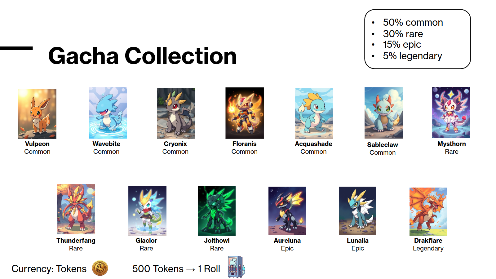
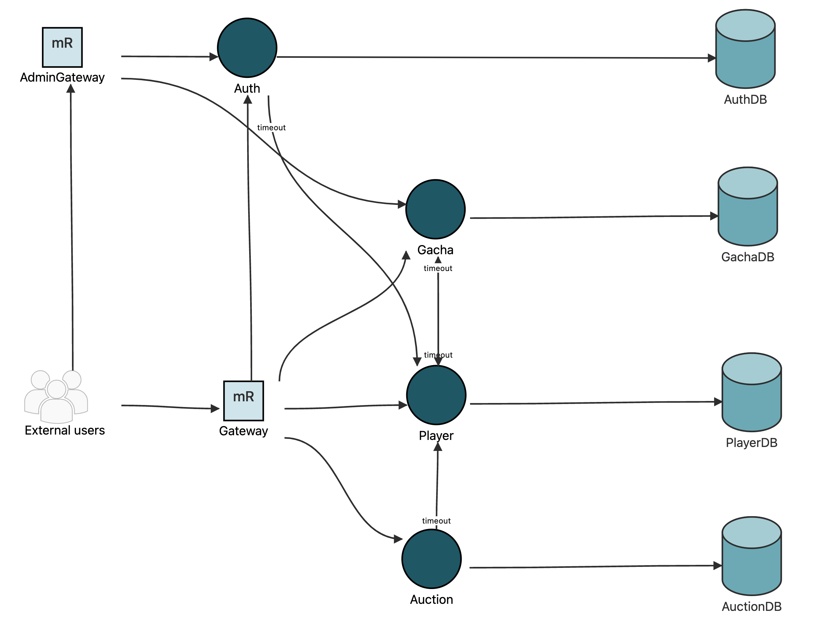
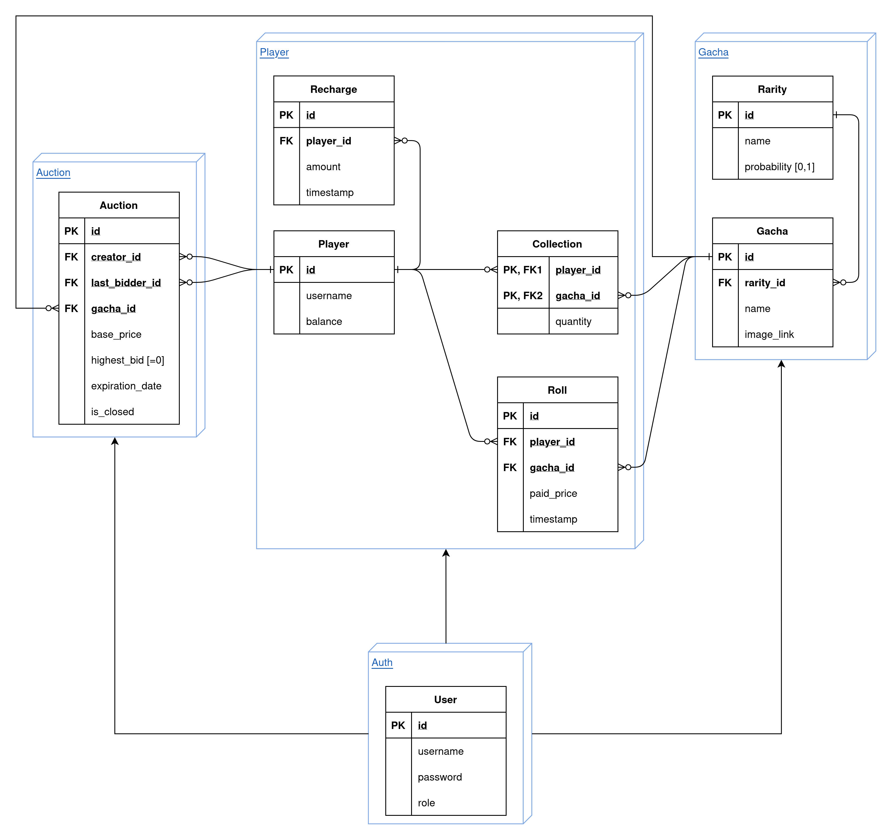
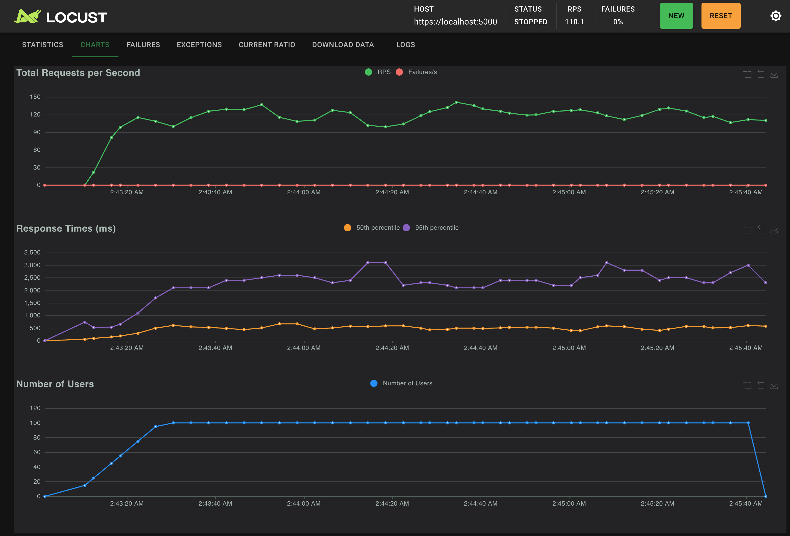
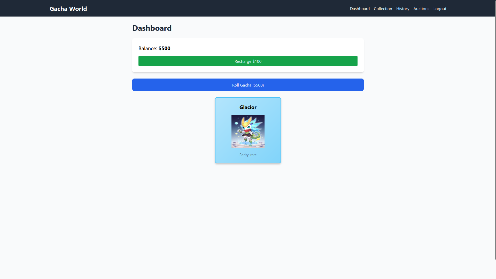
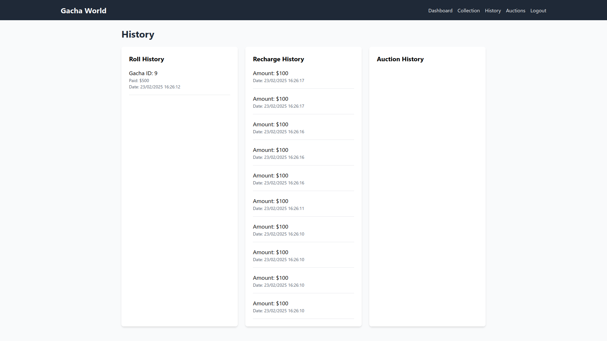
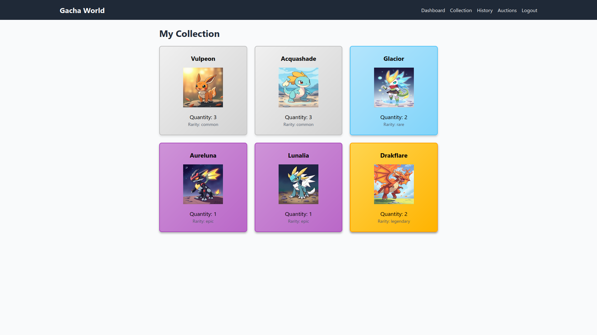
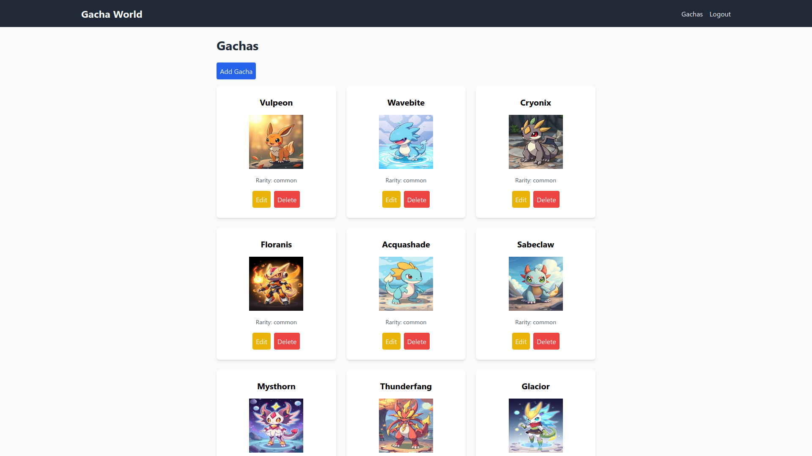

# Gacha Game Backend Development Report

## Overview

This report outlines the development of a Gacha Game Backend using modern technologies and best practices. The system was built using **FastAPI** for the backend, **NGINX** as a reverse proxy, and **Docker** for containerization. The project emphasizes security, scalability, and maintainability, leveraging **OAuth2** for authentication, **JWT** for secure token management, and **self-signed certificates** for secure communication. The system was rigorously tested using **Postman**, **Locust**, **pip-audit**, **Bandit**, and **Dependabot**, with continuous integration and deployment managed through **GitHub Actions**.

The backend supports a variety of operations for both **players** and **admins**, including gacha rolls, auctions, player management, and authentication. The system was designed with a clear separation of concerns, ensuring that admin and player operations are distinct and secure. The use of **SQLAlchemy** as the ORM (Object-Relational Mapping) tool ensures that the system is database-agnostic and scalable.



---

## Architecture

The system is composed of several microservices, each responsible for a specific domain:

1. **Player Service**: Manages player data, including balance, collections, and gacha rolls.
2. **Gacha Service**: Handles gacha-related operations, such as rolling for gachas and managing gacha collections.
3. **Auction Service**: Facilitates auctions where players can sell and bid on gachas.
4. **Auth Service**: Manages user authentication, registration, and token generation using OAuth2 and JWT.
5. **NGINX**: Acts as a reverse proxy, routing requests to the appropriate service and handling SSL termination.

All services are containerized using Docker, ensuring consistency across development, testing, and production environments. The system is designed to be scalable, with each service running independently and communicating over HTTPS. This distributed architecture allows for horizontal scaling, where additional instances of each service can be deployed to handle increased load.



---

## Database Schemas

The system uses **MySQL** databases for each service, with the following schemas:

### Player Service
- **Player**: Stores player information, including `id`, `username`, and `balance`.
- **Recharge**: Tracks player balance recharges with `id`, `player_id`, `amount`, and `timestamp`.
- **Collection**: Tracks player gacha collections with `player_id`, `gacha_id`, and `quantity`.
- **Roll**: Records gacha rolls with `id`, `player_id`, `gacha_id`, `paid_price`, and `timestamp`.

### Gacha Service
- **Gacha**: Stores gacha information, including `id`, `name`, `image_url`, and `rarity`.

### Auction Service
- **Auction**: Manages auctions with `id`, `creator_id`, `last_bidder_id`, `gacha_id`, `base_price`, `highest_bid`, `expiration_timestamp`, and `is_closed`.

### Auth Service
- **User**: Stores user credentials and roles with `id`, `username`, `password`, and `role`.



---

## Publicly Available Interface

The backend exposes a RESTful API, with endpoints divided into **player** and **admin** operations. Below is a summary of the key endpoints, including the required JSON payloads for each request:

### Player Operations
- **Authentication**:
  - `POST /auth/register`: Register a new player.
    ```json
    {
      "username": "player1",
      "password": "password123"
    }
    ```
  - `POST /auth/login`: Log in and receive a JWT token.
    ```json
    {
      "username": "player1",
      "password": "password123"
    }
    ```
  - `POST /auth/logout`: Log out and invalidate the token.

- **Gacha**:
  - `GET /players/roll`: Roll for a random gacha.
  - `GET /players/collection`: View the player's gacha collection.
  - `GET /players/balance`: Check the player's balance.
  - `POST /players/recharge/{player_id}/{amount}`: Recharge the player's balance.

- **Auction**:
  - `POST /auctions/sell`: Sell a gacha in an auction.
    ```json
    {
      "gacha_id": 1,
      "base_price": 10.0,
      "expiration_timestamp": 2145920400
    }
    ```
  - `POST /auctions/bid/{auction_id}/{bid}`: Bid on an auction.
  - `GET /auctions/personal`: View auctions the player is involved in.
  - `GET /auctions/`: View all active auctions.

### Admin Operations
- **Gacha Management**:
  - `POST /collection`: Add a new gacha.
    ```json
    {
      "name": "Rare Gacha",
      "rarity": "rare",
      "image": "<file>"
    }
    ```
  - `PUT /collection/{gacha_id}`: Update a gacha.
  - `DELETE /collection/{gacha_id}`: Delete a gacha.

- **Player Management**:
  - `PATCH /accounts/{old_username}/{new_username}`: Update a player's username.
  - `DELETE /accounts/{username}`: Delete a player.

---

## Security

The system employs several security measures:
- **OAuth2** and **JWT**: Used for secure authentication and authorization.
- **Self-Signed Certificates**: Ensure secure communication between services.
- **Role-Based Access Control**: Admins and players have distinct permissions.
- **Security Testing**: The system was tested using **pip-audit**, **Bandit**, and **Dependabot** to identify and mitigate vulnerabilities.

---

## Testing and Automation

The system was rigorously tested using:
- **Unit Testing**: Each microservice was unit tested to ensure individual components functioned correctly.
- **Integration Testing**: The entire system was integration tested to ensure that all services worked together seamlessly.
- **Postman**: Automated API testing with Newman and GitHub Actions.
- **Locust**: Stress testing to ensure the system can handle high traffic.
- **Security Testing**: Regular scans with **pip-audit**, **Bandit**, and **Dependabot** to ensure code security.
- **GitHub Actions**: Continuous integration and deployment, with automated testing and security checks.



---

## Gacha Images

The gacha system includes images for each gacha, stored in the `images` directory. These images are served statically and can be accessed via the `/images` endpoint. The Gacha Service handles the upload and management of these images, ensuring they are properly associated with the correct gacha.

---

## Mock Frontend (React)

A mock frontend was developed using **React** to simulate user interactions with the backend. The frontend includes:
- **Gacha Roll Interface**: Allows players to roll for gachas.
- **Auction Interface**: Enables players to create and bid on auctions.
- **Player Dashboard**: Displays the player's balance, collection, and auction history.
- **Admin Panel**: Allows admins to manage gachas and players.

### Roll interface



### History



### Gacha collection



### Admin panel



---

## Environment Initialization

The `init.sh` script initializes the environment by:
1. Creating self-signed certificates for all services.
2. Generating JWT keys for secure token management.
3. Setting up the necessary directories and permissions.

This script ensures that the environment is ready for development, testing, and deployment.

---

## Integration Testing

Integration tests were automated using **Postman** and **Newman**, with test cases covering:
- Player registration and authentication.
- Gacha rolls and collection management.
- Auction creation, bidding, and expiration.
- Admin operations for gacha and player management.

The test scripts automate the testing process, bringing up Docker containers, running tests, and tearing down the environment.

---

## Conclusion

The Gacha Game Backend is a robust, secure, and scalable system designed to handle a variety of player and admin operations. By leveraging modern technologies such as FastAPI, Docker, and NGINX, and adhering to best practices in security and testing, the system is well-suited for production deployment. The use of GitHub Actions for continuous integration and deployment ensures that the system remains reliable and secure throughout its lifecycle.

This project demonstrates a strong understanding of backend development, security, and DevOps practices, making it a valuable addition to any professional portfolio. The system's distributed architecture, combined with the use of SQLAlchemy for database management, ensures that it is both scalable and maintainable, ready to handle the demands of a growing user base.